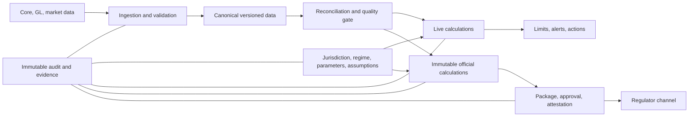

# AequorOS Enterprise Platform Audit

**Audit date:** 2026-08-20  
**Auditor posture:** Principal Architect, Chief Technology Risk Officer, Enterprise Financial Systems Auditor  
**Scope:** Repository source, migrations, tests, dashboard, operator console, CI configuration, architecture/product documentation, and local migration state. This is a point-in-time code audit; concurrent changes continued during the review. Code and tests were treated as evidence; product claims were not accepted without an execution path.

## 1. Executive Summary

AequorOS has stronger foundations than a typical early financial SaaS product: explicit tenant context, Postgres RLS for tenant tables, immutable official runs, value-based input hashes, lineage-backed canonical ingestion, attestation-aware reporting, a separated operator entry point, and substantial domain test coverage.

It is **not ready to onboard a real regulated financial institution as enterprise financial infrastructure**. The principal gap is not a missing screen; it is incomplete control closure across calculation, configuration, lifecycle, operations, and jurisdiction boundaries. Several features are genuine but must not yet be represented as regulator-ready: SDI stress, real ORASS submission, multi-jurisdiction regulatory operation, operator privileged access, and recoverable production operations.

The most material verified concerns are:

- SDI enterprise stress does not yet use the SDI liquidity regime end-to-end.
- Enterprise-stress paid-up-capital minima can bypass the new regulatory parameter authority.
- A macro scenario can be approved without a complete three-year macro path.
- The local database is behind the regulatory-parameter migration head.
- Cross-tenant worker/operator access relies on coding discipline while using BYPASSRLS.
- The control plane permits a tenant override to weaken a global regulatory floor.
- The ORASS contract is explicitly provisional; it is an external integration dependency, not a production submission capability.
- The release pipeline does not verify generated API client freshness or production data migration integrity.

## 2. Overall Production Readiness

**Assessment: Conditional prototype / controlled pilot only.**

A supervised Ghana pilot can be considered only after the stop-ship list is closed, with a restricted scope: one institution, controlled ingestion sources, non-production or sandbox regulatory submission, manual operational oversight, and no claim that SDI stress or cross-jurisdiction reporting is production-ready.

## 3. Stop-Ship Findings

| ID | Severity | Domain | Finding |
| --- | --- | --- | --- |
| F-01 | P0 | Financial calculation / regulatory | SDI enterprise stress retains Basel LCR/NSFR as the core liquidity result rather than the required SDI LMTD/reserve/maturity/concentration regime. |
| F-02 | P0 | Regulatory / financial calculation | Enterprise-stress paid-up-capital minima bypass the regulatory-parameter resolver and may resolve to zero. |
### Phase 0 — Immediate Stop-Ship

| F-03 | P0 | Governance / regulatory | Macro scenarios can be approved with one year and one driver; missing years/drivers neutralize rather than block the stress run. |
| F-04 | P1 | Operational / release | Local schema is at `202608190024`, while source head is `202608200025`; the regulatory-parameter table/seed is not applied in the audited runtime. |
| F-05 | P1 | Tenancy / security | Operator and worker roles require BYPASSRLS; cross-tenant safety is code-discipline based, not enforced at the query boundary. |
| F-06 | P1 | Governance / regulatory | Tenant board overrides are documented as “tighten only” but no common enforcement prevents a weaker override. |
| F-07 | P1 | Regulatory operations | ORASS API paths, payload, status mapping, and authentication are provisional pending BoG/Regnology onboarding. |
| F-08 | P1 | Security / identity | Password users lack MFA/step-up protection for general privileged operations; privileged staff actions lack a uniform step-up/PAM control. |

## 4. Top 20 Institutional Risks

1. F-01: SDI stress uses the wrong liquidity control framework.
2. F-02: Paid-up minimum can be omitted from enterprise stress.
3. F-03: Approved macro scenarios need not be complete or three-year.
4. F-04: Migration/runtime state is not aligned with source.
5. F-05: BYPASSRLS worker/operator paths can leak data after an omitted filter.
6. F-06: Regulatory minima can be weakened by a tenant override.

7. F-07: Real ORASS submission contract remains external/unvalidated.
8. F-08: MFA/PAM is insufficient for institutional privileged access.
9. F-09: No evidence of tested backup restore, RPO/RTO, or production disaster recovery.
10. F-10: Financial fact derivation can plug balance-sheet gaps and proceed; a material reconciliation exception must block filing.
11. F-11: ECL, CCF, product-category, and behavioral defaults can produce a result without a complete governed input mapping.
12. F-12: Market-data fallback/staleness can remain usable without a uniform calculation-blocking policy for critical valuations.

13. F-13: SDI paid-up/reserve diagnostic failures are not uniformly propagated into live findings, alerts, and official-run gates.
14. F-14: Module scoping is implemented in the dashboard but needs complete API-route enforcement and negative coverage.
15. F-15: Generated OpenAPI freshness is not a CI gate.
16. F-16: Migration tests validate schema shape more strongly than real data migration/rollback safety.
17. F-17: No demonstrated performance/load envelope for institutional books, concurrent jobs, exports, or reporting deadlines.

18. F-18: Privileged operator actions are audited but do not uniformly have before/after state, dual approval, step-up, rollback, and notification controls.
19. F-19: Regional expansion remains blocked by Ghana/currency/timezone-specific defaults in selected adapters and regulatory code paths.
20. F-20: Several control concepts exist as models/statuses but lack a single enterprise limit, exception, policy, and issue-management system.

## 5. Architecture Assessment

**Strengths:** Pure-domain calculations are widely separated from services; official runs are immutable; live/current state is explicitly separated from filing evidence; generated client usage is established; operator API is deployed separately from tenant API.

**Gaps:** The platform contains both bank-scoped treasury architecture and legacy case-scoped financial workspace architecture. This is manageable only while clear ownership boundaries are enforced. A second risk is policy scattering: institution type, jurisdiction, threshold, workflow, and entitlement decisions occur in multiple services rather than behind a small set of central policy resolvers.

**Finding F-21 — P2 Architecture:** institution/jurisdiction policy is not yet a complete first-class configuration layer. Examples include the default `GH` jurisdiction in [backend/app/models/regulatory_parameter.py](backend/app/models/regulatory_parameter.py), a `GHS` default in [backend/app/models/temenos.py](backend/app/models/temenos.py), and Ghana-specific behavior in selected training/reporting paths. Replace scattered conditionals/defaults with explicit `Jurisdiction -> Regulator -> InstitutionType -> Regime -> ReturnFamily -> ParameterSet` resolution.

## 6. Multi-Tenancy Assessment

**Score: 3/5.** Tenant JWT claims, explicit `organization_id` filters, composite keys, and RLS are strong for the normal tenant API. [backend/app/api/deps.py](backend/app/api/deps.py) validates the organization and active user before a tenant session is used.

**F-05 — P1 Tenancy:** [backend/app/worker.py](backend/app/worker.py) and [backend/app/operator/deps.py](backend/app/operator/deps.py) deliberately use BYPASSRLS-capable connections. A worker or operator query missing an explicit organization predicate can read or mutate cross-tenant rows. This is an architectural risk, not a demonstrated current IDOR.

**Expected state:** use constrained database views/procedures or repository helpers that require organization scope; maintain a multi-tenant worker integration test for every job class and an inspector-query enforcement test. Do not rely solely on reviewer discipline.

## 7. Security & Identity Assessment

**Score: 2/5.** The tenant API uses verified bearer tokens rather than header trust; OIDC validation, separate staff identities, encrypted credentials, and append-only signing controls are material strengths.

**F-08 — P1 Identity:** ordinary password sessions lack MFA and there is no demonstrated device/session management, immediate session revocation, or step-up requirement for all privileged tenant and staff operations. A banking deployment needs MFA for administrators, approvers, integration-key rotation, data export, role changes, and operator break-glass actions.

**F-22 — P2 Security:** integration-key authentication is a global hash lookup before tenant context and has no demonstrated rate limit or anomaly alert. Add distributed IP/key-prefix throttling, failed-attempt telemetry, key-use alerts, expiry/rotation policy, and an explicit service-account permission scope.

**F-23 — P2 Security:** do not treat broad CORS settings or upload validation as benign defaults. Validate content, scan untrusted uploads, enforce size/type/schema limits, and redact credentials from unhandled exception paths. The environment file was found locally but is ignored/untracked; this audit did not read secret contents and cannot substantiate a repository secret leak.

## 8. Operator Console Assessment

**Score: 2/5.** The separate operator process and append-only `operator_audit_log` are good boundaries. Tenant provisioning is a saga and the regulatory-parameter UI/API provides a genuine maker-checker capability.

**F-18 — P1 Governance:** privileged operator actions are not protected by one standardized high-risk-action control. An institutional control plane needs classified actions, confirmation, reason, before/after values, target organization, active support/inspection session, optional second approval, step-up authentication, notification, and rollback/reconciliation semantics.

**F-24 — P2 Operations:** the console needs a searchable operator-audit viewer, failed-job/retry visibility, tenant health and configuration drift view, support-access register, and emergency-action workflow. A table alone is not an operator control.

## 9. Staff Console Assessment

**Score: 2/5.** Read-only examiner impersonation is deliberately pinned in [backend/app/api/deps.py](backend/app/api/deps.py), which is positive.

**F-25 — P1 Privileged access:** staff access domains are not sufficiently separated into support, operations, implementation, security, regulatory operations, and super-admin. The present role model is too coarse for a provider with access to client financial data. Implement time-bounded JIT access, purpose binding, approval for sensitive tenant inspection, row/document export restrictions, session recording, and periodic access review.

## 10. Treasury Assessment

**Score: 2/5.** Cash, deposits, securities, interbank, FX, and market-data foundations exist through canonical positions and calculation modules. The platform is not yet a complete treasury operating system.

Missing or partial institutional capabilities: deal capture/approval, dealing and counterparty limit hierarchy, settlement/intraday liquidity, collateral/encumbrance lifecycle, funding plan, treasury P&L, independent valuations, cash positioning, payment/nostro reconciliation, and exception workflow. These should be positioned as roadmap, not current functionality.

## 11. ALM Assessment

**Score: 2/5.** IRRBB, contractual gaps, behavioral assumptions, FTP and forecasting exist. The live/official split and source-as-of provenance are good design choices.

**F-26 — P2 ALM:** behavioral, contractual, and stressed maturity are not yet governed under one assumption/version framework with mandatory coverage and effectivity. Conservative silent fallbacks for unmapped deposit/prepayment assumptions can produce a plausible ratio with a materially different economic meaning. Require completeness status, approval, scenario/as-of/version provenance, and a filing block for material unmapped books.

## 12. Liquidity Assessment

**Score: 2/5.** LCR/NSFR, LMTD material, EWI, CFP, ladders, and reverse stress are substantive. Current/live and official calculations are intentionally separated.

**F-01 — P0 Liquidity:** SDI enterprise stress currently carries Basel liquidity outcomes. See [backend/app/services/enterprise_stress.py](backend/app/services/enterprise_stress.py), [backend/app/domain/stress/orchestrator.py](backend/app/domain/stress/orchestrator.py), and [backend/dashboard/components/stress/EnterpriseStressWorkbench.tsx](backend/dashboard/components/stress/EnterpriseStressWorkbench.tsx). For an SDI, the binding stress result must be Table-1 ratios, reserve checks, maturity gap, concentration, counterbalancing capacity, and survival horizon.

**F-27 — P2 Liquidity data quality:** material balance-sheet gaps must be a blocking reconciliation exception, not merely a plug/warning in [backend/app/services/fact_derivation.py](backend/app/services/fact_derivation.py). A financial filing cannot consume an unexplained balancing plug above a governed tolerance.

## 13. Capital Assessment

**Score: 2/5.** Standardized RWA, capital composition, ECL/CRM components, stress paths, and an SDI simplified view exist.

**F-02 — P0 Capital:** `_resolve_paid_up_min` in [backend/app/services/enterprise_stress.py](backend/app/services/enterprise_stress.py) uses request/tenant threshold or zero; it does not consume licence-specific `regulatory_parameters.resolve(..., "paid_up_min")`. The same legal minimum can therefore differ between capital diagnostics and stress/Appendix II.

**F-13 — P1 Capital controls:** [backend/app/services/sdi_capital_checks.py](backend/app/services/sdi_capital_checks.py) exposes paid-up and reserve checks as diagnostics. Failure must also create live findings, feed alerts/risk limits, constrain official run/report approval, and be present in the immutable reporting snapshot.

## 14. Credit & Exposure Assessment

**Score: 2/5.** Connected counterparties, large-exposure calculations, related-party hooks, class-specific limits, and loan classification have meaningful implementation.

**F-28 — P2 Credit configuration:** unknown product/risk categories, CCF, collateral and ECL segment assumptions must not silently resolve to generic defaults for material exposure. Defaulting can be conservative but is still a data-quality exception requiring explicit status, owner, and filing decision.

**F-29 — P3 Credit:** no complete enterprise limit lifecycle is evident for counterparty, group, sector, product, currency, tenor, desk, and institution limits. A return calculation is not a pre-deal or ongoing exposure limit control.

## 15. Market Risk / FX Assessment

**Score: 2/5.** FX NOP, VaR/stressed VaR, depreciation scenarios, curves and market-data adapters provide a foundation.

**F-12 — P2 Market data:** source attribution and staleness propagate, but critical calculation initiation needs a governed policy for stale/missing curves, FX rates, and fallback synthetic curves. A user must see whether a result is blocked, degraded, or intentionally based on a fallback. Persist that decision in calculation/report evidence.

## 16. IRRBB Assessment

**Score: 2/5.** EVE, NII/EaR, duration and Basel shocks are present.

**F-30 — P2 IRRBB:** establish an assumption-governance register for repricing buckets, optionality, behavioral deposits, prepayments, curves, and scenario shock methodology. Each report needs the exact curve, interpolation, model version, assumption set, and effective date. Add boundary tests for low/negative rate scenarios, missing tier-one capital and rounding at regulatory thresholds.

## 17. Stress Testing Assessment

**Score: 2/5.** Macro scenario CRUD, translation, immutable enterprise runs, Appendix II tables, management actions, per-risk components, sign-off, and the workbench are substantial.

**F-03 — P0 Scenario governance:** [backend/app/schemas/stress.py](backend/app/schemas/stress.py) accepts `horizon_years=1` and one driver/path; [backend/app/services/macro_scenarios.py](backend/app/services/macro_scenarios.py) approves it. A direct schema probe during this audit accepted exactly that case. The run API later requires three years, but absent year/driver points translate to neutral values rather than a comprehensive scenario failure.

**Expected state:** approve only complete, internally coherent scenario profiles for their intended use. Enforce horizon coverage, required driver matrix, severity/type semantics, applicable institution types, source/narrative, and model/elasticity version. Require three-year scenario coverage for enterprise/ICAAP use.

## 18. Data Engine Assessment

**Score: 3/5.** Canonical ingestion, batch lifecycle, lineage records, supersession and async refresh are stronger than average.

**F-31 — P2 Data quality:** large-batch deferred dedup is operationally reasonable but creates a temporary lineage/readiness ambiguity. Surface `dedup_status=deferred` prominently and ensure data consumers/reports cannot treat delayed entity resolution as complete validation.

**F-32 — P2 Data correction:** corrections/supersession need a full user-visible restatement workflow: original source, corrected record, reason, impact analysis, recomputed outputs, affected official reports, required approval, and regulator resubmission decision.

## 19. Data Model & Lineage Assessment

**Score: 3/5.** The canonical model has strong ingestion provenance and official runs have valuable value-based snapshots.

**F-33 — P2 Lineage:** not every derived management/regulatory result demonstrates a uniform source-to-report evidence chain. Require every headline metric to carry source batches, source snapshot/as-of, parameter generations, engine/model version, assumption/scenario IDs, and calculation hash in a queryable evidence model, not only inside heterogeneous JSON payloads.

## 20. Reconciliation Assessment

**Score: 1/5.** There is no demonstrated platform-wide reconciliation service.

Required controls: GL-to-position, position-to-fact, fact-to-engine, engine-to-return, source-to-export, package-to-submission, and market-data-to-valuation reconciliation; configurable tolerances; break reasons; ownership; approval; aging; and filing blocks. Financial identities such as Assets = Liabilities + Equity, capital component totals, NOF, HQLA, RWA totals and report roll-ups must be executable invariants.

## 21. Regulatory Parameter Assessment

**Score: 2/5.** The new global, effective-dated regulatory-parameter control plane is an important step. It has proposal/approval states, confirmation status, source citation, an operator surface, and a resolver.

**F-06 — P1 Regulatory configuration:** the documented “tenant may only tighten” rule is not enforced. A bank-specific override can be less conservative than the global legal minimum. Implement typed parameter semantics (`minimum`, `maximum`, `rate`, `amount`, `enum`) and validate override direction against the effective global value.

**F-34 — P2 Regional configuration:** [backend/app/models/regulatory_parameter.py](backend/app/models/regulatory_parameter.py) has a Ghana default for `jurisdiction_code`. Regulatory data must be explicit and jurisdiction-bound; never silently default a new regulator/country to Ghana.

## 22. Regulatory Reporting Assessment

**Score: 3/5 for Ghana templates; 1/5 for real regulator integration and regional scope.** The package lifecycle, validation, immutable artifacts, signing/attestation, workflow state machine and template-first BoG form approach are strong.

**F-07 — P1 External regulatory dependency:** [backend/app/services/regulatory_reporting/channels/orass_api.py](backend/app/services/regulatory_reporting/channels/orass_api.py) identifies its wire contract as provisional. Do not certify real electronic ORASS submission until the regulator/vendor specification, authentication, response handling, rejection/resubmission semantics and end-to-end sandbox certification are complete.

**F-35 — P2 Reporting completeness:** SDI return family integration is intentionally empty pending an official return pack. This is an external dependency, not a defect to fabricate. The product must block onboarding promises that imply SDI supervisory return generation before the BoG pack and mapping are obtained.

## 23. Governance Assessment

**Score: 2/5.** Regulatory package maker-checker and attestation are genuine. Macro scenarios and management action plans have meaningful approval states. However, enterprise governance remains fragmented by domain.

Missing platform controls: policy hierarchy; policy exception/waiver lifecycle; limit ownership and delegated authority; committee calendar/minutes/decisions; action remediation; issue/finding management; documented model validation; management and board attestations outside reporting; and evidence retention/search.

## 24. Workflow / Maker-Checker Assessment

**Score: 2/5.** The regulatory reporting state machine in [backend/app/services/regulatory_reporting/workflow.py](backend/app/services/regulatory_reporting/workflow.py) enforces several critical transitions and maker-checker checks.

**F-36 — P2 Workflow:** maker-checker is not a generalized, policy-driven workflow engine. High-risk data corrections, parameter changes, operator actions, market-data overrides, assumptions, limit changes, and model releases do not consistently share: proposer/checker separation, effectivity, rejection, expiry, stale-approval invalidation, immutable history, and notification.

## 25. Auditability Assessment

**Score: 3/5.** `audit_events`, package approvals, signatures, operator audit logs and immutable run snapshots are valuable.

**F-37 — P2 Auditability:** audit records are not yet a complete control evidence system. For high-risk actions, require normalized before/after state, correlation/request/session identifiers, tenant/bank scope, reason, approval linkage, source IP/device where appropriate, evidence attachments, retention policy, immutable/tamper-evident export, and staff audit search. Audit log existence alone is not governance.

## 26. Observability Assessment

**Score: 2/5.** Structured logs, health endpoints, job retries, live state and some freshness signals exist.

**F-38 — P1 Observability:** no demonstrated production SLOs, metric/trace backend, alert routing, error budget, control-monitoring dashboard, reconciliation-break alert, failed submission alert, tenant-scoped job failure queue, or incident ownership model. The auto-reloader churn observed during this audit reinforces the need for production-process separation and log aggregation.

## 27. Resilience / Disaster Recovery Assessment

**Score: 1/5.** The job reaper and retry model are useful resilience primitives.

**F-09 — P1 Resilience:** no evidence was found of tested backup restore, formal RPO/RTO, multi-AZ/failover design, storage recovery, disaster runbooks, regulator-outage procedure tests, or quarterly recovery exercises. A financial platform cannot infer recoverability from Docker compose and a database backup assumption.

## 28. Performance / Scale Assessment

**Score: 1/5.** No capacity benchmark demonstrates the stated workload envelope.

**F-17 — P2 Scale:** there are no verified performance targets for 10k/100k/1m positions, historical records, concurrent tenant calculations, queue contention, large export generation, or market-data bursts. Several services read and transform broad fact/position sets in request/job transactions. Define SLOs, profile production-shaped books, partition/materialize where required, apply bounded concurrency, and test backpressure.

## 29. Testing Assessment

**Score: 3/5.** The hermetic suite passed `3199 passed, 304 skipped` during this audit. Focused SDI/stress suites passed `192`. Dashboard and console typechecks passed. This is strong regression evidence.

**F-39 — P1 Test gaps:** tests need stronger negative and integration coverage: multi-tenant worker contamination, BYPASSRLS operator queries, direct API module-gate denial, parameter-override weakening, migration upgrade against representative data, backup restore, crash/retry idempotency, storage failure, market-data outage, real submission contract, load/performance, and destructive privileged action step-up. Passing unit tests do not prove institutional control operation.

## 30. CI/CD Assessment

**Score: 2/5.** CI lint/typechecks/tests/Postgres migration checks and generated-client typecheck are present.

**F-15 — P2 Release control:** [`.github/workflows/risk-service.yml`](.github/workflows/risk-service.yml) runs generated-client typecheck but not the repository's `risk-service:api-fresh` diff/freshness task. Add a required generated-artifact freshness gate.

**F-40 — P2 CI/CD:** add dependency/SBOM vulnerability scanning, migration compatibility validation against representative data, staging smoke/e2e gates, deployment approval and change record, database migration backup/rollback gate, production readiness checks, canary/rollback, and release evidence retention.

## 31. Ghana Readiness

**Score: 2/5.** Ghana-specific BoG templates, GHS conventions, institution types, return lifecycle, LMTD work and ORASS sandbox concepts are meaningful. Launch remains blocked by final ORASS contract certification, client CoA/data mapping and reconciliation, confirmed parameter packs, signature configuration, and tested regulator-outage/submission runbooks. Treat every unavailable form or unconfirmed protocol as an **EXTERNAL REGULATORY DEPENDENCY**.

## 32. Regional Expansion Readiness

**Score: 1/5.** Jurisdiction and institution-type registries are the right start. The platform is not yet regionally extensible without removing GHS/Accra/default-Ghana assumptions from adapters, training, deadlines, regulatory parameters and return selection. Expansion needs a jurisdiction pack: regulator, business calendar, currency/FX convention, institution types, reporting family, parameter catalogue, taxonomy mapping and submission channel.

## 33. Missing Enterprise Capabilities

- Enterprise limits: hierarchy, utilization, pre-deal controls, breach, waiver, escalation and evidence.
- ALCO workflow: agenda, decisions, minutes, actions, pack composition and accountability.
- Treasury operations: deal capture, approval, funding/placement, settlement, collateral and intraday cash.
- Reconciliation operations: break management, certification, root-cause and filing block.
- Model risk management: inventory, validation, calibration, drift, override and approval.
- Privileged access management, records retention/legal hold, client offboarding, and operational resilience management.

## 34. Technical Debt

| Debt | Class | Priority |
| --- | --- | --- |
| Dual case and bank financial planes | Architecture/domain | P2 |
| BYPASSRLS query discipline | Security/tenancy | P1 |
| Legacy registers plus new parameter control plane | Regulatory/domain | P1 |
| JSON-heavy evidence/output models | Data/audit | P2 |
| Ghana defaults in models/adapters | Regional/domain | P1 |
| No performance harness | Testing/operations | P2 |
| Concurrent migration-head management | Release/data | P1 |
| Documentation lag against code | Operations | P2 |

## 35. Hardcoded Regulatory Assumptions

Regulatory floors, DPD/provisioning grids, risk weights, exposure limits, deadlines/timezones, data-staleness tolerance, FTP/curve tolerance, CCF defaults, behavioral defaults, stress elasticities and currency/jurisdiction defaults must be governed data or explicitly justified methodology constants. Each must carry jurisdiction, institution type/class, effective date, source, confirmation state, owner, approver and override semantics.

## 36. Data Integrity Risks

- A material balance-sheet plug can create a usable calculation rather than a blocking exception.
- Defaulted CCF, category, ECL and behavioral inputs can create false precision.
- Corrected data needs impact tracing to every run, package, report and submission.
- Financial time must distinguish source as-of, close calendar/timezone, ingestion time and parameter effectivity.

## 37. Calculation Invariants

1. Assets = liabilities + equity within governed tolerance; material gaps block filing.
2. GL, positions, facts, capital structure and reports reconcile or have approved breaks.
3. Group exposure equals the aggregation of its members and is never below an individual member.
4. Liquidity ratio components reconcile to underlying rows.
5. Same source snapshot, policy/scenario/configuration and engine versions yield the same result/hash.
6. Base scenario equals stress where every stress path equals base.
7. Report totals equal sealed source calculations; fallback market data is visible and permitted.
8. Approved records are immutable; changed inputs supersede/invalidate approvals.

## 38. Control Matrix

| Capability | Owner | Required control | Current evidence | Gap |
| --- | --- | --- | --- | --- |
| Regulatory parameter | Regulatory operations | effective-dated maker-checker, tighten-only override | control-plane API/model | weakening override allowed |
| Tenant isolation | Security | RLS + scoped repositories + test | tenant API context/RLS | BYPASSRLS discipline risk |
| Official calculation | Risk/finance | sealed snapshot/hash/version | `RegulatoryRun` | not uniform everywhere |
| Data correction | Data steward | supersession + impact review/approval | lineage | no restatement workflow |
| Submission | Reporting officer | lifecycle/signing/channel acknowledgement | package/attestation | ORASS provisional |
| SDI liquidity | CRO/ALCO | LMTD/reserve stress | partial components | enterprise stress wrong regime |
| Staff access | Provider security | JIT scope/step-up/audit | separate operator app | no uniform PAM |
| Async jobs | SRE | idempotency/retry/org scope | reaper/queue | handler scope relies on code |
| DR | CTO | tested RPO/RTO/restore | no evidence found | material gap |

## 39. Production Readiness Scorecard

| Domain | Score / 5 | Evidence for score below 4 |
| --- | ---: | --- |
| Architecture | 3 | strong patterns; policy and legacy-plane fragmentation |
| Multi-tenancy | 3 | RLS normal path; BYPASSRLS exception risk |
| Security / Identity / RBAC | 2 | good JWT/OIDC; MFA/PAM/ABAC gaps |
| Operator / Staff console | 2 | separation exists; privileged controls incomplete |
| Treasury / ALM / Liquidity / Capital | 2 | engines exist; operations/reconciliation/control closure incomplete |
| Credit / Market / IRRBB | 2 | useful measures; configuration/governance gaps |
| Stress testing | 2 | substantial framework; P0 scenario/SDI gaps |
| Data engine / lineage | 3 | canonical lineage strong; restatement/reconciliation incomplete |
| Regulatory parameters | 2 | control plane exists; migration/override gap |
| Regulatory reporting | 3 | strong lifecycle/templates; external channel dependency |
| Governance / workflow / audit | 2 | vertical controls, not a platform control system |
| Observability / resilience / performance | 1 | no proven SLO, DR, restore or scale envelope |
| Testing / CI/CD | 3 / 2 | broad tests; key negative/integration/release gates missing |
| Ghana / regional readiness | 2 / 1 | Ghana foundation; external gates and defaults remain |

## 40. Prioritized Remediation Roadmap

### Phase 0 — Immediate Stop-Ship

| Problem | Implementation | Test |
| --- | --- | --- |
| F-01 | Replace SDI Basel stress output with LMTD/reserve/ladder/concentration/survival outcome | SDI scenario has no LCR/NSFR payload |
| F-02/F-06 | Central paid-up resolver and typed tighten-only override guard | legal floor agrees across checks, stress and report |
| F-03 | Scenario approval/execution completeness matrix | reject one-year/missing-driver scenario |
| F-04 | Apply/test migration head and deployment gate | migrated DB resolver smoke |
| F-05 | Enforced scoped repositories and worker/operator isolation tests | cross-tenant query/job denial |

### Phase 1 — Client Onboarding Hardening

Reconciliation controls; client CoA/data mapping; MFA/PAM; controlled correction/restatement; ORASS sandbox certification; submission/outage runbooks; alert ownership and escalation.

### Phase 2 — Regulatory and Governance Hardening

Generalized approvals/exceptions; policy and parameter change management; SDI return pack after receipt; enterprise limits; committee decisions; audit evidence and retention.

### Phase 3 — Treasury / ALM Hardening

Deal/counterparty/funding controls; intraday liquidity; assumption/model governance; ALCO/board packs and scenario comparison.

### Phase 4 — Scale / Security / Resilience

DR/restore exercises; SLOs/telemetry; queue operation; capacity/load testing; partitioning/materialization; deployment control and rollback.

### Phase 5 — Regional Architecture

Jurisdiction packs; removal of Ghana defaults; per-regulator calendar/reporting/channel and currency/taxonomy governance.

## 41. "Do Not Onboard Until..." Checklist

- [ ] SDI stress is corrected or excluded from the contractual scope.
- [ ] Paid-up minima are centrally resolved and enforced in calculation/reporting.
- [ ] Approved enterprise scenarios are complete, coherent and three-year.
- [ ] Migration head is applied and deployment validation passes.
- [ ] BYPASSRLS paths have enforceable scope controls and integration tests.
- [ ] Tenant overrides cannot weaken legal minima.
- [ ] ORASS is certified, or the product is explicitly sandbox/manual with consent.
- [ ] MFA/PAM and privileged access evidence are active.
- [ ] Material reconciliation failures block filing.
- [ ] Backup restore and submission-outage procedures are tested.

## 42. Recommended Target Architecture

One policy resolver per decision; no silent financial defaults; reconciliation before compliance; live and official planes never substitute for each other; high-risk mutations share workflow/evidence controls; external integrations remain uncertified until contract-tested.

## 43. Final Audit Conclusion

AequorOS is a credible engineering foundation with unusually strong calculation and regulatory-reporting primitives for its maturity. It is not yet institutional-grade financial infrastructure. Prioritize control closure, reproducibility, privileged access, reconciliation, migration discipline and operational recoverability over additional dashboard breadth.

**Evidence:** full backend suite `3199 passed, 304 skipped`; focused SDI/stress suites `192 passed`; dashboard and console typechecks passed. These prove regression health for covered behavior, not production certification.

